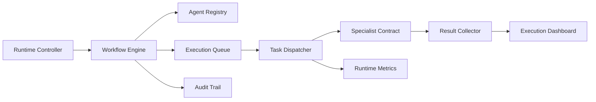

# FCX Agent Master Phase 5 Runtime Operational

## Status

**FCX Agent Operating System - Local Operational Runtime**

Phase 5 transforms the Agent Master into a bounded local runtime. No external service, production infrastructure, or real deployment is connected.

## Components

| Component | Responsibility |
| --- | --- |
| Runtime Controller | Exposes workflow, registry, queue, reports, and dashboard APIs |
| Workflow Engine | Executes complete sequential workflows |
| Agent Registry | Publishes available executable specialists and capabilities |
| Execution Queue | Tracks queued, running, completed, and failed steps |
| Task Dispatcher | Dispatches local specialist contracts |
| Result Collector | Produces workflow execution reports and audit evidence |
| Execution Dashboard | Aggregates agents, workflows, queue, metrics, and reports |

## Runtime Flow



## API

- `POST /api/agent-runtime/workflows/execute`
- `GET /api/agent-runtime/workflows`
- `GET /api/agent-runtime/workflows/:workflowId`
- `GET /api/agent-runtime/registry`
- `GET /api/agent-runtime/queue`
- `GET /api/agent-runtime/reports`
- `GET /api/agent-runtime/reports/:workflowId`
- `GET /api/agent-runtime/dashboard`

## Dashboard

The frontend route `/agent-runtime` displays runtime KPIs, agent registry, execution queue status, and recent reports.

## Validation

Run from `backend`:

```text
npm run phase5:validate
```

Generated reports:

- `docs/validation/PHASE_5_RUNTIME_EXECUTION_REPORT.json`
- `docs/validation/PHASE_5_RUNTIME_DASHBOARD.json`
- `docs/validation/PHASE_5_RUNTIME_VALIDATION_REPORT.md`

## Boundaries

- Runtime state is bounded and in memory.
- Specialist execution is simulated through local contracts.
- Token consumption remains zero until real model execution is approved.
- Phase 2 RBAC, PostgreSQL, Redis, human approval, and deployment governance remain the target production architecture.
