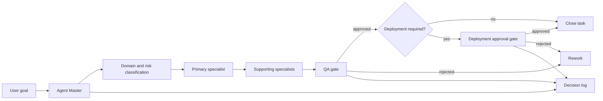

# FCX 6.0 Agent Master Vibe Coding Architecture

## Purpose

The Agent Master turns a user goal into an auditable FCX workflow. It classifies the task, assesses risk, routes work to bounded specialists, records every governance decision, and enforces QA and deployment approval gates.

The architecture extends the existing NestJS `AgentsModule`; it does not replace current FCX services or agent skill APIs.

## Components

| Component | Location | Responsibility |
| --- | --- | --- |
| Versioned agent definitions | `agents/` | Human-reviewable policies, prompts, tools, and constraints |
| Agent registry | `backend/src/modules/agents/agent-registry.ts` | Runtime source of registered agents |
| Agent Master | `master-agent.service.ts` | Builds the execution plan and delegates routing |
| Task router | `task-router.service.ts` | Classifies domain/risk and selects specialists |
| Decision log | `decision-log.service.ts` | Stores bounded, auditable routing and approval decisions |
| Approval workflow | `approval-workflow.service.ts` | Enforces QA-before-deployment |
| API | `agents-api.controller.ts` | Exposes orchestration and governance endpoints |

## Execution Flow

## Runtime API

| Method | Endpoint | Purpose |
| --- | --- | --- |
| `GET` | `/agents` | List the Agent Master and specialists |
| `POST` | `/api/agents/route` | Classify, route, plan, and initialize approvals |
| `GET` | `/api/agents/decisions?taskId=...` | Read decision logs |
| `GET` | `/api/agents/approvals/:taskId` | Read task approval state |
| `POST` | `/api/agents/approvals/:taskId/qa` | Approve or reject QA |
| `POST` | `/api/agents/approvals/:taskId/deployment` | Approve or reject deployment |
| `POST` | `/api/agents/run-skill` | Existing skill execution API, preserved |

## Safety Properties

- All tasks require QA.
- High-risk, critical, and deployment tasks require deployment approval.
- Deployment cannot be approved before QA.
- Trade and Sports Quant agents remain research/simulation only.
- Critical industrial/electrical actions require human review.
- Decision logs must not contain secrets or unrestricted payloads.
- Unknown domains fall back to strategic review.

## Current Persistence Boundary

Decision and approval records are intentionally stored in bounded process memory for this first integration. This avoids an unreviewed database migration and preserves the current schema.

Before horizontal scaling or production use, persist these records in PostgreSQL and use Redis only for short-lived orchestration state. Add tenant isolation and authenticated reviewer identity before exposing approval APIs externally.

## Phase 2 Governance Definitions

Phase 2 defines the target governance architecture without activating production infrastructure:

- Tenant RBAC: `docs/RBAC_MODEL.md`
- Formal approval state machine: `docs/APPROVAL_WORKFLOW.md`
- PostgreSQL proposal: `backend/prisma/proposals/agent-master-phase2-postgresql.sql`
- Redis orchestration: `docs/REDIS_ORCHESTRATION.md`
- Audit trail: `docs/AUDIT_TRAIL.md`
- Agent metrics: `docs/AGENT_METRICS.md`
- Deployment governance: `docs/DEPLOYMENT_GOVERNANCE.md`
