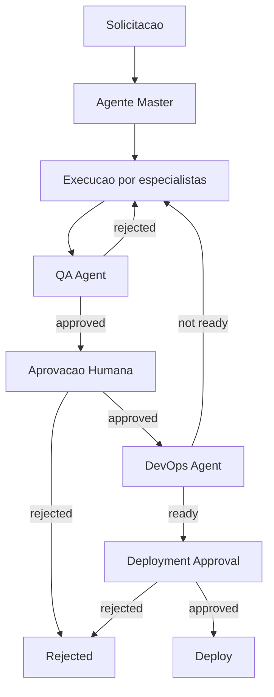

# FCX Agent Master Approval Workflow

## Mandatory Flow



No deployment may occur without a registered human approval.

## State Machine

Canonical definition: `agents/master/governance/approval-state-machine.json`.

Required deployment path:

`requested -> routed -> executing -> qa_pending -> qa_approved -> human_pending -> human_approved -> deployment_pending -> deployment_approved -> deploying -> completed`

## Gate Requirements

### QA Agent

Validates acceptance criteria, tests, build, security evidence, regressions, and documentation. The QA Agent can recommend or register QA evidence but cannot provide human approval or deploy.

### Human Approval

Requires an authenticated user with `approval.human.review`. The approval records task, tenant, reviewer, reason, evidence reference, expiry, and timestamp.

### DevOps Agent

Validates target environment, artifact digest, rollback plan, observability, backup readiness, and change window. In Phase 2 it is definition-only and cannot call real infrastructure.

## Invariants

- Client-provided risk can only escalate, never downgrade, server-classified risk.
- Rejection or revocation of a prerequisite invalidates downstream approvals.
- Approval transitions use optimistic locking and idempotency keys.
- Terminal states reject ordinary mutations.
- Critical tasks require distinct QA, human, and DevOps reviewers.
- Approvals expire before deployment when policy requires.

## Evidence Model

Each gate references bounded evidence rather than embedding unrestricted content:

```json
{
  "evidenceType": "test-result",
  "reference": "artifact://test-results/sha256:...",
  "digest": "sha256:...",
  "createdAt": "ISO-8601",
  "result": "passed"
}
```
