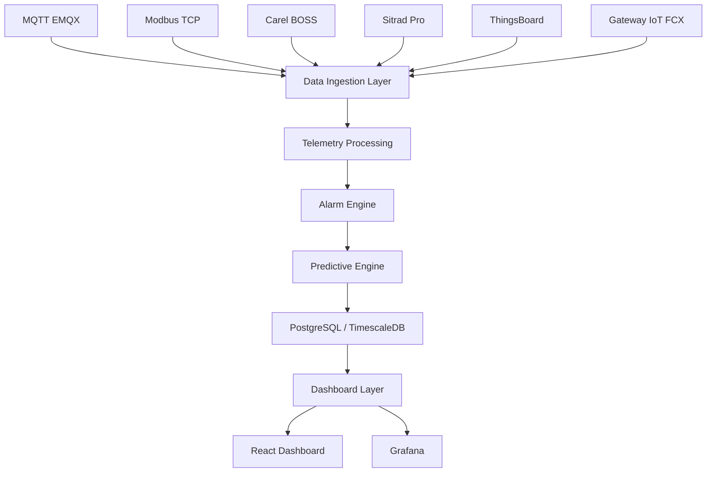

# FCX Industrial Intelligence OS - Arquitetura de Integracoes

## Visao geral

O FCX Industrial Intelligence OS organiza a ingestao industrial em uma cadeia unica de tratamento de dados. Cada conector traduz seu protocolo de origem para um payload comum de telemetria, que passa por processamento, motor de alarmes, motor preditivo e finalmente alimenta APIs e dashboards.



## Camadas

### 1. Data Ingestion Layer

Responsavel por receber dados industriais de varias origens e encaminhar tudo para um fluxo comum. Implementado no NestJS pelo `DataIngestionService`.

Entradas atuais:

- MQTT EMQX
- Modbus TCP
- Carel BOSS
- Sitrad Pro
- ThingsBoard
- Gateway IoT FCX
- API manual em `POST /integrations/ingest`

Payload normalizado esperado:

```json
{
  "assetId": "uuid-do-ativo",
  "timestamp": "2026-06-02T13:00:00.000Z",
  "temperatura": 22.5,
  "vibracao": 1.8,
  "corrente": 34.1,
  "tensao": 380,
  "potencia": 22.4,
  "pressaoSuccao": 3.2,
  "pressaoDescarga": 14.8
}
```

### 2. Telemetry Processing

Responsavel por normalizar nomes de campos, converter numeros, calcular potencia quando necessario e padronizar timestamp. Implementado pelo `TelemetryProcessingService`.

Exemplos de compatibilidade:

- `pressaoSuccao` ou `pressao_succao`
- `pressaoDescarga` ou `pressao_descarga`
- `energia` pode ser usada como `potencia`
- `potencia` pode ser estimada a partir de corrente e tensao

### 3. Alarm Engine

Responsavel por avaliar regras tecnicas iniciais e gerar alarmes no banco. Implementado pelo `AlarmEngineService`.

Regras iniciais:

- Temperatura acima de 35 C gera alarme critico.
- Vibracao acima de 6 mm/s gera alarme critico.
- Corrente acima de 100 A gera alarme de aviso.

Quando um alarme e criado, o ativo relacionado passa para status `ALARM`.

### 4. Predictive Engine

Responsavel por gerar uma pontuacao inicial de risco operacional. Implementado pelo `PredictiveEngineService`.

Entradas consideradas:

- Temperatura
- Vibracao
- Corrente

Saidas:

- `riskScore`: 0 a 100
- `status`: `normal`, `attention` ou `high-risk`
- `recommendations`: recomendacoes tecnicas simples

### 5. Dashboard Layer

Responsavel por expor dados para o frontend React e para o Grafana.

APIs principais:

- `GET /dashboards`
- `GET /assets`
- `GET /telemetry`
- `GET /alarms`
- `GET /work-orders`

## Conectores

### MQTT EMQX

Servico: `MqttEmqxService`

Assina o topico configurado em `MQTT_TELEMETRY_TOPIC`, por padrao:

```text
fcx/telemetry/+
```

Cada mensagem deve ser JSON e conter pelo menos `assetId`.

### Modbus TCP

Servico: `ModbusTcpService`

Configuracao:

- `MODBUS_HOST`
- `MODBUS_PORT`
- `MODBUS_UNIT_ID`

Endpoint manual:

```http
POST /integrations/modbus/read
```

Body:

```json
{ "assetId": "uuid-do-ativo" }
```

### Carel BOSS

Servico: `CarelBossService`

Configuracao:

- `CAREL_BOSS_URL`
- `CAREL_BOSS_TOKEN`

Endpoint manual:

```http
POST /integrations/carel-boss/pull
```

Body:

```json
{ "assetId": "uuid-do-ativo", "deviceId": "id-no-boss" }
```

### Sitrad Pro

Servico: `SitradProService`

Configuracao:

- `SITRAD_PRO_URL`
- `SITRAD_PRO_TOKEN`

Endpoint manual:

```http
POST /integrations/sitrad-pro/pull
```

### ThingsBoard

Servico: `ThingsBoardService`

Configuracao:

- `THINGSBOARD_URL`
- `THINGSBOARD_TOKEN`

Endpoint manual:

```http
POST /integrations/thingsboard/pull
```

### Gateway IoT FCX

Servico: `FcxGatewayService`

Configuracao:

- `FCX_GATEWAY_URL`

Endpoint manual:

```http
POST /integrations/fcx-gateway/pull
```

## Simulador MQTT

Script:

```text
backend/scripts/mqtt-simulator.js
```

Comando local:

```powershell
cd backend
npm run mqtt:simulator
```

O simulador:

- consulta ativos em `GET /assets`
- escolhe um ativo aleatorio
- publica em `fcx/telemetry/{assetId}`
- envia temperatura, vibracao, corrente, tensao, energia/potencia e pressoes
- repete a cada 5 segundos

No Docker Compose, o servico `mqtt-simulator` sobe junto com o ambiente.
