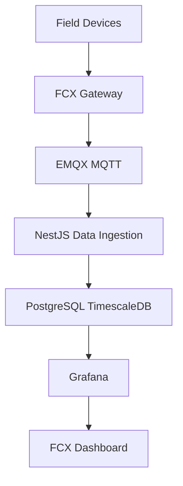

# FCX Industrial Data Acquisition Layer

## Objetivo

Substituir dados simulados por dados reais vindos de campo, preservando rastreabilidade completa entre payload bruto, telemetria processada, eventos de alarme, dashboards e analiticos preditivos.

## Arquitetura



## Fluxo operacional

1. Dispositivos de campo enviam leituras para Gateway FCX, CLP, controlador BOSS, Sitrad, ThingsBoard ou broker MQTT.
2. O FCX recebe dados via MQTT Subscriber, Modbus TCP Gateway ou conectores HTTP.
3. O payload original e gravado em `telemetry_raw`.
4. O payload e normalizado e gravado em `telemetry_processed`.
5. O Alarm Service avalia limites tecnicos e grava eventos em `alarm_events`.
6. TimescaleDB guarda series temporais para consultas rapidas.
7. Grafana e FCX Dashboard consomem os dados processados.

## Simulacao

O simulador MQTT continua disponivel para laboratorio, mas nao sobe por padrao. Para iniciar simulacao explicitamente:

```powershell
docker compose --profile simulation up -d mqtt-simulator
```

## Tabelas

### telemetry_raw

Armazena payload bruto.

Campos principais:

- `id`
- `asset_id`
- `source`
- `protocol`
- `topic`
- `payload`
- `received_at`

### telemetry_processed

Armazena dados normalizados.

Campos principais:

- `id`
- `raw_id`
- `asset_id`
- `source`
- `timestamp`
- `temperatura`
- `vibracao`
- `corrente`
- `tensao`
- `potencia`
- `pressao`
- `pressao_succao`
- `pressao_descarga`
- `umidade`
- `quality`

### alarm_events

Armazena eventos gerados pela camada de aquisicao.

Campos principais:

- `id`
- `asset_id`
- `source`
- `severidade`
- `titulo`
- `descricao`
- `metric`
- `value`
- `threshold`
- `timestamp`
- `status`

## Servicos NestJS

- `MqttSubscriberService`: assina topicos EMQX e envia payloads para ingestao.
- `MqttPublisherService`: publica payloads MQTT para gateway ou testes reais.
- `AcquisitionTelemetryService`: grava raw, normaliza e grava processed.
- `AcquisitionAlarmService`: cria eventos em `alarm_events`.
- `AcquisitionAssetService`: resolve `assetId` ou `externalId`.
- `ModbusTcpGatewayService`: le registradores Modbus TCP.
- `CarelBossConnectorService`: busca telemetria no Carel BOSS.
- `SitradProConnectorService`: busca telemetria no Sitrad Pro.
- `ThingsBoardConnectorService`: busca telemetria no ThingsBoard.

## Endpoints

Arquitetura:

```http
GET /acquisition/architecture
```

Ingestao manual:

```http
POST /acquisition/ingest
```

Publicacao MQTT:

```http
POST /acquisition/mqtt/publish
```

Modbus:

```http
POST /acquisition/modbus/read
```

Carel BOSS:

```http
POST /acquisition/carel-boss/pull
```

Sitrad Pro:

```http
POST /acquisition/sitrad-pro/pull
```

ThingsBoard:

```http
POST /acquisition/thingsboard/pull
```

## Topico MQTT padrao

```text
fcx/telemetry/{assetId}
```

Wildcard assinado:

```text
fcx/telemetry/+
```

## Exemplo completo

```json
{
  "assetId": "uuid-do-ativo",
  "timestamp": "2026-06-02T16:00:00.000Z",
  "temperatura": 24.8,
  "vibracao": 1.7,
  "corrente": 32.5,
  "tensao": 380,
  "potencia": 21.4,
  "pressao": 13.2,
  "pressaoSuccao": 3.1,
  "pressaoDescarga": 14.8,
  "umidade": 62.5
}
```

## Exemplos por variavel

### Temperatura

```json
{
  "assetId": "uuid-do-ativo",
  "temperatura": 24.8
}
```

### Vibracao

```json
{
  "assetId": "uuid-do-ativo",
  "vibracao": 1.7
}
```

### Corrente

```json
{
  "assetId": "uuid-do-ativo",
  "corrente": 32.5
}
```

### Potencia

```json
{
  "assetId": "uuid-do-ativo",
  "potencia": 21.4
}
```

Se `potencia` nao vier no payload, o FCX pode estimar potencia quando `corrente` e `tensao` existirem.

### Pressao

```json
{
  "assetId": "uuid-do-ativo",
  "pressao": 13.2,
  "pressaoSuccao": 3.1,
  "pressaoDescarga": 14.8
}
```

### Umidade

```json
{
  "assetId": "uuid-do-ativo",
  "umidade": 62.5
}
```

## Exemplo de publicacao MQTT via API

```json
{
  "topic": "fcx/telemetry/uuid-do-ativo",
  "payload": {
    "assetId": "uuid-do-ativo",
    "temperatura": 24.8,
    "vibracao": 1.7,
    "corrente": 32.5,
    "tensao": 380,
    "potencia": 21.4,
    "pressao": 13.2,
    "umidade": 62.5
  }
}
```

## Regras iniciais de alarmes

- Temperatura acima de 35 gera evento critico.
- Vibracao acima de 6 gera evento critico.
- Corrente acima de 100 gera evento de aviso.
- Potencia acima de 75 gera evento de aviso.
- Pressao acima de 22 gera evento de aviso.
- Umidade acima de 85 gera evento de aviso.
