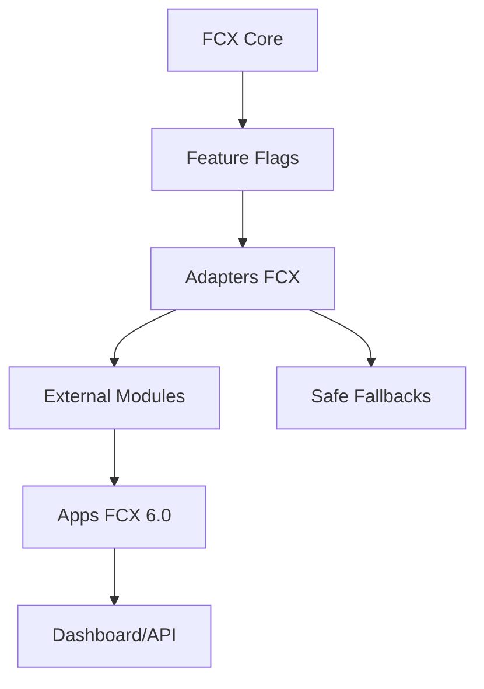

# FCX 6.0 Modules Integration

## Objetivo

Adicionar repositorios GitHub da conta `felipe-castello` como modulos independentes do FCX 6.0, sem misturar codigo externo no core principal e sem quebrar o FCX 5.0.

## Status dos submodulos

A tentativa de adicionar os repositorios como `git submodule` foi bloqueada no ambiente local por erro Git/Windows:

```text
fatal error - couldn't create signal pipe, Win32 error 5
```

Foram criados placeholders operacionais em `fcx-6.0/modules`. Em ambiente com Git liberado, remova o README de cada pasta e execute os comandos de `git submodule add` indicados nos READMEs dos modulos.

## Arquitetura



## Repositorios e funcoes

| Modulo | Repositorio | Funcao |
| --- | --- | --- |
| agent-skills | `felipe-castello/agent-skills` | Biblioteca de skills para agentes FCX |
| LibreChat | `felipe-castello/LibreChat` | Interface conversacional opcional |
| langchain | `felipe-castello/langchain` | Chains, agentes, RAG e LangGraph |
| nango | `felipe-castello/nango` | Hub de integracoes externas |
| QuantDinger | `felipe-castello/QuantDinger` | Motor quantitativo separado |
| Understand Anything | `felipe-castello/Understand-Anything` | Ingestao e entendimento de documentos |

## Camada FCX

Apps:

- `fcx-6.0/apps/fcx-agent-console`
- `fcx-6.0/apps/fcx-rag-knowledge`
- `fcx-6.0/apps/fcx-quant-engine`
- `fcx-6.0/apps/fcx-integrations-hub`

Adapters:

- `fcx-6.0/packages/fcx-agent-skills-adapter`
- `fcx-6.0/packages/fcx-langchain-adapter`
- `fcx-6.0/packages/fcx-nango-adapter`
- `fcx-6.0/packages/fcx-quantdinger-adapter`
- `fcx-6.0/packages/fcx-knowledge-adapter`
- `fcx-6.0/packages/fcx-librechat-adapter`

## Endpoints iniciais

```http
POST /api/agents/run-skill
POST /api/knowledge/ingest
POST /api/quant/analyze
POST /api/integrations/sync
POST /api/chat/session
```

## Feature flags

```env
ENABLE_AGENT_SKILLS=false
ENABLE_LIBRECHAT=false
ENABLE_LANGCHAIN=true
ENABLE_NANGO=false
ENABLE_QUANTDINGER=false
ENABLE_UNDERSTAND_ANYTHING=false
```

Cada modulo externo deve ser carregado apenas quando sua flag estiver ativa. Se o modulo falhar, o FCX retorna fallback seguro e registra erro com prefixo `FCX_MODULE_FALLBACK`.

## Variaveis de ambiente

```env
GITHUB_TOKEN=
OPENAI_API_KEY=
ANTHROPIC_API_KEY=
GOOGLE_API_KEY=
NANGO_SECRET_KEY=
NANGO_HOST=
LANGCHAIN_API_KEY=
LANGCHAIN_TRACING_V2=true
FCX_ENV=production
FCX_MODE=modular
FCX_RISK_MODE=conservative
```

## Como rodar

Backend:

```powershell
cd backend
npm install
npm run start:dev
```

Adapters:

```powershell
node fcx-6.0\packages\fcx-module-adapters.test.js
```

Submodulos, quando o Git estiver liberado:

```bash
git submodule update --init --recursive
```

## Dependencias previstas

- Node.js LTS
- NestJS
- LangChain/LangGraph
- LibreChat
- Nango
- QuantDinger
- Understand Anything
- Providers LLM: OpenAI, Anthropic ou Google

## Riscos

- Submodulos externos podem quebrar build se forem importados diretamente no core.
- Integracoes OAuth exigem governanca de escopos e rotacao de secrets.
- QuantDinger nao pode operar em modo real nesta fase.
- LibreChat nao deve substituir o dashboard principal.
- Ingestao documental pode expor dados sensiveis se nao houver classificacao e permissoes.

## Roadmap de integracao

1. Inicializar submodulos em ambiente com Git liberado.
2. Validar licencas, dependencias e superficie de seguranca de cada repositorio.
3. Conectar adapters aos SDKs reais por feature flag.
4. Criar testes de contrato por endpoint.
5. Adicionar observabilidade por modulo.
6. Integrar UI no dashboard FCX sem remover o fluxo industrial atual.
7. Promover cada modulo de `research` para `beta` somente apos validacao.
