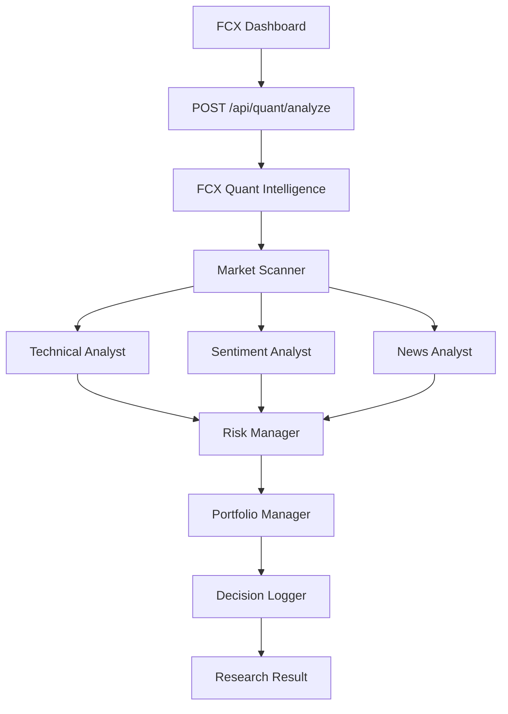

# FCX TradingAgents Integration

## Objetivo

Integrar o repositorio TradingAgents como modulo independente de pesquisa quantitativa dentro do FCX Intelligence Platform 6.0, sem misturar o codigo do framework no core industrial ou no FCX 5.0.

O modulo nasce como FCX Quant Intelligence powered by TradingAgents. Ele deve operar apenas em modo de pesquisa, simulacao e dashboard. Nenhuma ordem real deve ser executada por esta integracao.

## Status do TradingAgents

A preferencia tecnica e manter o TradingAgents como `git submodule` em:

```powershell
fcx-6.0/modules/trading-agents/
```

Comando previsto:

```powershell
Remove-Item fcx-6.0\modules\trading-agents\README.md
git submodule add https://github.com/TauricResearch/TradingAgents fcx-6.0/modules/trading-agents
git submodule update --init --recursive
```

No ambiente atual, a tentativa de criacao do submodulo falhou por restricao local do Git/Windows:

```text
fatal error - couldn't create signal pipe, Win32 error 5
```

Por isso, foi criada uma pasta isolada com README operacional. O codigo do TradingAgents ainda deve ser baixado como submodulo em uma maquina com Git liberado.

## Arquitetura



## Camadas criadas

- `fcx-6.0/modules/trading-agents/`: local reservado para o submodulo TradingAgents.
- `fcx-6.0/apps/fcx-quant-trading/`: wrapper operacional FCX para pesquisa, simulacao, logs e futura UI.
- `fcx-6.0/packages/fcx-trading-agents-adapter/`: adapter funcional em Node.js.
- `backend/src/modules/quant/`: endpoint NestJS para o FCX Intelligence Core.

## Fluxo de dados

1. O dashboard ou cliente envia `symbol`, `market`, `timeframe` e `mode`.
2. O backend valida que o modo e apenas `research`, `simulation` ou `dashboard`.
3. O Market Scanner prepara o ativo e o contexto de mercado.
4. Analistas tecnico, sentimento e noticias geram sinais.
5. O Risk Manager avalia o risco antes de qualquer decisao final.
6. O Portfolio Manager produz `BUY`, `SELL`, `HOLD` ou `REVIEW`.
7. O Risk Manager aplica a regra final: `riskScore > 70` retorna `BLOCK`; `confidence < 60` retorna `REVIEW`.
8. O Decision Logger registra a saida para auditoria.

## Endpoint backend

```http
POST /api/quant/analyze
```

Payload:

```json
{
  "symbol": "AAPL",
  "market": "stocks",
  "timeframe": "1d",
  "mode": "research"
}
```

Resposta:

```json
{
  "decision": "HOLD",
  "confidence": 65,
  "riskScore": 45,
  "summary": "FCX Quant Intelligence analisou AAPL em stocks/1d. Decisao HOLD, confianca 65, risco 45.",
  "agents": [
    "Market Scanner",
    "Technical Analyst",
    "Sentiment Analyst",
    "News Analyst",
    "Risk Manager",
    "Portfolio Manager",
    "Decision Logger"
  ],
  "warnings": []
}
```

## Variaveis de ambiente

Arquivo base:

```text
fcx-6.0/.env.example
```

Variaveis:

```env
OPENAI_API_KEY=
ANTHROPIC_API_KEY=
GOOGLE_API_KEY=
FINNHUB_API_KEY=
REDDIT_CLIENT_ID=
REDDIT_CLIENT_SECRET=
TRADING_AGENTS_MODE=research
FCX_RISK_MODE=conservative
```

Pelo menos uma chave de provider LLM deve existir: `OPENAI_API_KEY`, `ANTHROPIC_API_KEY` ou `GOOGLE_API_KEY`.

## Como rodar local

1. Copiar as variaveis:

```powershell
Copy-Item fcx-6.0\.env.example fcx-6.0\.env
```

2. Configurar pelo menos uma API key LLM.

3. Rodar o backend:

```powershell
cd backend
npm install
npm run start:dev
```

4. Testar:

```powershell
Invoke-RestMethod -Method Post `
  -Uri http://localhost:3000/api/quant/analyze `
  -ContentType "application/json" `
  -Body '{"symbol":"AAPL","market":"stocks","timeframe":"1d","mode":"research"}'
```

## Como rodar em Docker

O modulo Quant usa o backend NestJS existente. Em producao, inclua as variaveis do bloco Quant no `.env.production` usado pelo Docker Compose.

Comando esperado:

```bash
docker compose -f docker-compose.production.yml up -d --build
```

O submodulo TradingAgents deve ser inicializado antes do build quando for usado diretamente:

```bash
git submodule update --init --recursive
```

## Integracao com dashboard FCX

Criar uma pagina futura em `FCX Dashboard > Quant Intelligence` consumindo:

- `decision`
- `confidence`
- `riskScore`
- `summary`
- `agents`
- `warnings`

Widgets recomendados:

- Market Scanner
- Decisao atual
- Confianca do modelo
- Risco consolidado
- Historico de decisoes
- Alertas do Risk Manager

## Riscos e limitacoes

- Nao e recomendacao financeira direta.
- Nao executa ordens reais.
- Depende de qualidade de dados externos.
- Sem API keys, a analise deve falhar de forma explicita.
- Sinais de noticias e sentimento ficam limitados sem credenciais externas.
- O submodulo TradingAgents precisa ser inicializado fora do sandbox atual.
- Toda decisao deve passar pelo Risk Manager antes de ser exibida.

## Regras obrigatorias

- `riskScore > 70`: retornar `BLOCK`.
- `confidence < 60`: retornar `REVIEW`.
- Modo inicial: `research`.
- Proibido executar compra, venda ou qualquer ordem real.
